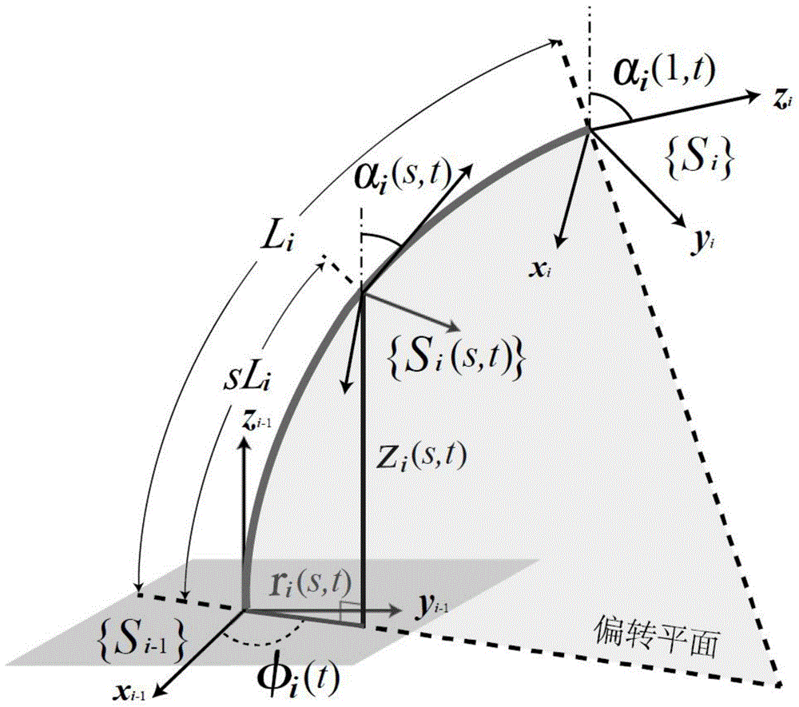
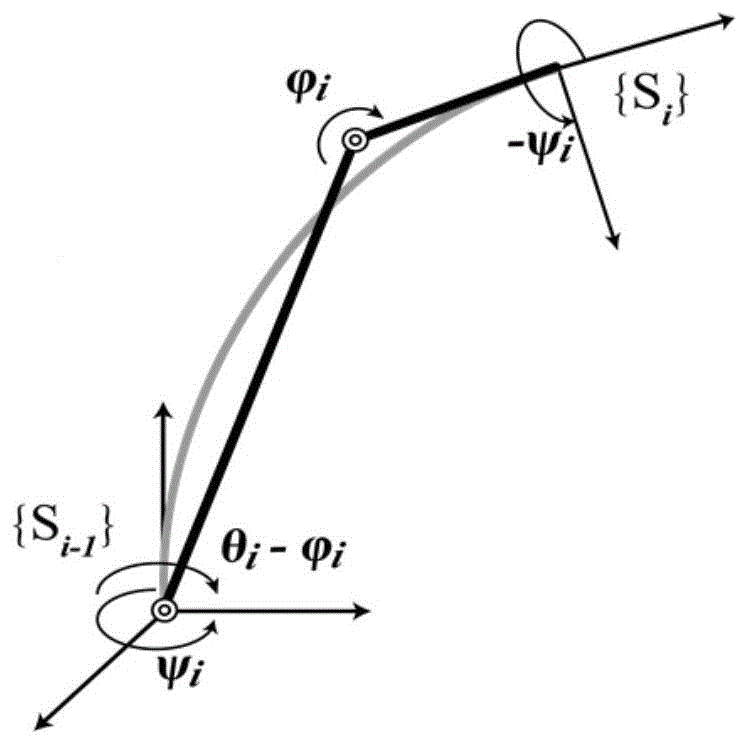

  I am Hao Cheng (程淏). Currently, I am working toward the Ph.D. degree in Mechanics at Peking University, China, under the supervision of <a href="http://www2.coe.pku.edu.cn/faculty/zhangfeitian/" style="text-decoration: underline;">Prof. Feitian Zhang</a>. My research interests include lighter-than-air (LTA) aerial robots, continuum robots, and bioinspired robotics. 
    
  <strong>Email</strong>: <a href="mailto:h-cheng@stu.pku.edu.cn" style="text-decoration: underline;">h-cheng@stu.pku.edu.cn</a> (during Ph.D.) &emsp; <a href="mailto:hc.robotic@gmail.com" style="text-decoration: underline;">hc.robotic@gmail.com</a> (long-term)

---

# Education

&emsp;**College of Engineering, Peking University** &emsp; _09/2021 - present_  
&emsp;*Beijing, China*   
&emsp;Ph.D. candidate in Mechanics

&emsp;**Department of Automation, Tsinghua University** &emsp; _09/2018 - 08/2021_  
&emsp;*Beijing/Shenzhen, China*  
&emsp;M.S. in Control Engineering 

&emsp;**New Energy School, North China Electric Power University** &emsp; _08/2013 - 06/2017_  
&emsp;*Beijing, China*  
&emsp;B.E. in Wind Power (**Outstanding Graduate at Beijing**)

&emsp;**Wrocław University of Science and Technology** &emsp; _02/2017 - 06/2017_  
&emsp;*Wrocław,  Poland*  
&emsp;Visiting Student

---

# Research Experience

&emsp;**College of Engineering, Peking University** &emsp; _09/2021 - present_  
&emsp;*Beijing, China*  
&emsp;Advisor:&nbsp;&nbsp;<a href="http://www2.coe.pku.edu.cn/faculty/zhangfeitian/" style="color: inherit; text-decoration: none;">Prof. Feitian Zhang</a>  
&emsp;Topic:&nbsp;&nbsp;Lighter-than-air aerial robots 

&emsp;**Shenzhen International Graduate School, Tsinghua University** &emsp; _09/2018 - 08/2021_  
&emsp;*Shenzhen, China*  
&emsp;Advisor:&nbsp;&nbsp;<a href="https://www.sigs.tsinghua.edu.cn/lhd_en/list.htm" style="color: inherit; text-decoration: none;">Prof. Houde Liu</a>, <a href="https://www.sigs.tsinghua.edu.cn/wxq_en/main.htm" style="color: inherit; text-decoration: none;">Prof. Xueqian Wang</a>  
&emsp;Topic:&nbsp;&nbsp;Perception and Control for Continuum Robots and Soft Robots 

---

# Publications

**Journal Articles**

  
  

    
<strong>Hao Cheng</strong>, Feitian Zhang

    
RGBlimp-Q: Robotic Gliding Blimp With Moving Mass Control Based on a Bird-Inspired Continuum Arm

    
IEEE Transactions on Robotics (<strong>T-RO</strong>), 2025 

    

      [<a href="https://ieeexplore.ieee.org/document/11129463" style="text-decoration: underline;">Paper</a>] 
      [<a href="https://rgblimp.github.io/" style="text-decoration: underline;">Project</a>] 
      [<a href="https://github.com/RGBlimp/RGBlimp-Q" style="text-decoration: underline;">Hardware & Code</a>] 
      [<a href="https://youtu.be/U8VfF37lHvU" style="text-decoration: underline;">Video</a>]  
      [<a href="https://arxiv.org/pdf/2406.10810" style="text-decoration: underline;">arXiv</a>]
      

  

  
  

    
Yongjian Zhu, <strong>Hao Cheng</strong>, Feitian Zhang

    
Data-Driven Dynamics Modeling of Miniature Robotic Blimps Using Neural ODEs With Parameter Auto-Tuning

    
IEEE Robotics and Automation Letters (<strong>RA-L</strong>), 2024 

    

      [<a href="https://ieeexplore.ieee.org/document/10723763" style="text-decoration: underline;">Paper</a>]  
      [<a href="https://github.com/zhu-yj/ABNODE" style="text-decoration: underline;">Code</a>]
      [<a href="https://arxiv.org/pdf/2404.18580" style="text-decoration: underline;">arXiv</a>]
      

  

  
  

    
<strong>Hao Cheng</strong>, Zeyu Sha, Yongjian Zhu, Feitian Zhang

    
RGBlimp: Robotic Gliding Blimp - Design, Modeling, Development, and Aerodynamics Analysis

    
IEEE Robotics and Automation Letters (<strong>RA-L</strong>), 2023 (<a href="../images/img/IROS24.jpg" style="color: red; font-weight: bold; text-decoration: none;">Oral Presentation</a> in IEEE <strong>IROS</strong> 2024)

    

      [<a href="https://ieeexplore.ieee.org/document/10258385" style="text-decoration: underline;">Paper</a>]
      [<a href="{{ site.baseurl }}/projects/#rgblimp" style="text-decoration: underline;">Project</a>]   
      [<a href="https://youtu.be/AkYN0jurYxI" style="text-decoration: underline;">Video</a>]  
      [<a href="https://arxiv.org/pdf/2306.04079" style="text-decoration: underline;">arXiv</a>]
      

  

**Conference Papers**

  
  

    
<strong>Hao Cheng</strong>, Hejie Xu, Hongji Shang, Xueqian Wang, Houde Liu, Bin Liang

    
Orientation to Pose: Continuum Robots Shape Reconstruction Based on the Multi-Attitude Solving Approach

    
IEEE International Conference on Robotics and Automation (<strong>ICRA</strong>), 2022 (<a href="../images/img/ICRA22.jpg" style="color: red; font-weight: bold; text-decoration: none;">Oral Presentation</a>)

    

      [<a href="https://ieeexplore.ieee.org/document/9812289" style="text-decoration: underline;">Paper</a>] 
      [<a href="{{ site.baseurl }}/projects/#continuum" style="text-decoration: underline;">Project</a>]  
      [<a href="https://youtu.be/tm9aPsXuPTo" style="text-decoration: underline;">Video</a>]  
      [<a href="https://arxiv.org/pdf/2103.05150" style="text-decoration: underline;">arXiv</a>]
      

  

  
  

    
<strong>Hao Cheng</strong>, Houde Liu, Xueqian Wang, Bin Liang

    
Configuration Estimation of Continuum Robots Using Piecewise Constant Curvature Generalized Epi-Polar Constraint Model

    
IEEE 17th International Conference on Automation Science and Engineering (CASE), 2021

    

      [<a href="https://ieeexplore.ieee.org/document/9551587" style="text-decoration: underline;">Paper</a>] 
      

  

  
  

    
<strong>Hao Cheng</strong>, Houde Liu, Xueqian Wang, Bin Liang

    
Approximate Piecewise Constant Curvature Equivalent Model and Their Application to Continuum Robot Configuration Estimation

    
IEEE International Conference on Systems, Man, and Cybernetics (SMC), 2020

    

      [<a href="https://ieeexplore.ieee.org/document/9283135" style="text-decoration: underline;">Paper</a>]  
      [<a href="https://arxiv.org/pdf/2009.06801" style="text-decoration: underline;">arXiv</a>]
      

  

**Patents**

  
  

    
Houde Liu, <strong>Hao Cheng</strong>, Xueqian Wang, Bin Lan, Bin Liang

    
Continuum Robot Shape Sensing Method Based on the Multi-attitude Solving Approach

    
(一种基于多姿态解算的连续型机器人形状感知方法), Chinese Patent CN113211440B, 2020

    

      [<a href="https://patents.google.com/patent/CN113211440B/en" style="text-decoration: underline;">Google Patents</a>]  
      

  

  
  

    
Bin Liang, Houde Liu, <strong>Hao Cheng</strong>, Xueqian Wang, Bin Lan 

    
Kinematic Equivalence Method of Continuum Robot and Its Application

    
(一种连续型机器人运动学等效方法及应用), Chinese Patent CN111695213B, 2020

    

      [<a href="https://patents.google.com/patent/CN111695213B/en" style="text-decoration: underline;">Google Patents</a>]  
      

  

---

# Awards & Honors

-  **National Scholarship** (Doctoral), China, 2025
-  **Academic Innovation Award**, Peking University, 2025
-  Outstanding Research Award, Peking University, 2022
-  Comprehensive Excellence Scholarship, Tsinghua University, 2020
-  **Outstanding Graduate at Beijing**, China, 2017
-  **National Scholarship**, China, 2015
-  National Encouragement Scholarship, China, 2014 and 2016
-  First-Class Scholarship, North China Electric Power University, 2014, 2015, and 2016

---

# Competitions

- **1st Prize**, Inclusive Design Comp. (Lead, suitcase for visually impaired), 2025
- 2nd Prize, Graduate Future Flight Vehicle Design Comp. (Lead, robotic gliding blimp), 2024
- 2nd Prize, Graduate Robotics Design Comp. (Lead, spinal rehab robot), 2021 [<a href="{{ site.baseurl }}/projects/#spinal" style="text-decoration: underline;">Project</a>]
- 2nd Place, ZC-Cup Frontier Tech. Challenge (Contribution in maze navigation), 2020 [<a href="{{ site.baseurl }}/projects/#maze" style="text-decoration: underline;">Project</a>]
- **1st Prize**, Capital Mechanical Innovation Design Comp. (Lead, packaging robot), 2016
- **1st Prize**, China Siemens-Cup Intelligent Manufacturing Challenge, 2016
- **Champion**, Robots Comp. of Universities at Beijing (Lead, robot combat), 2015 [<a href="{{ site.baseurl }}/projects/#battle" style="text-decoration: underline;">Project</a>]
- 2nd Prize, Beijing Eng. Ability Compet. (Lead, Bluetooth cargo robot), 2015 [<a href="{{ site.baseurl }}/projects/#bcar" style="text-decoration: underline;">Project</a>]
- 2nd Prize, LQ-Cup C/C++ Programming Comp. (individual), 2015
- 2nd Prize, National Olympiad in Informatics in Provinces (NOIP, individual, C++), 2012

---

# Academic Service

- Reviewer for IEEE T-RO, ICRA, IROS, CDC, ACC, and IEEE/ASME AIM