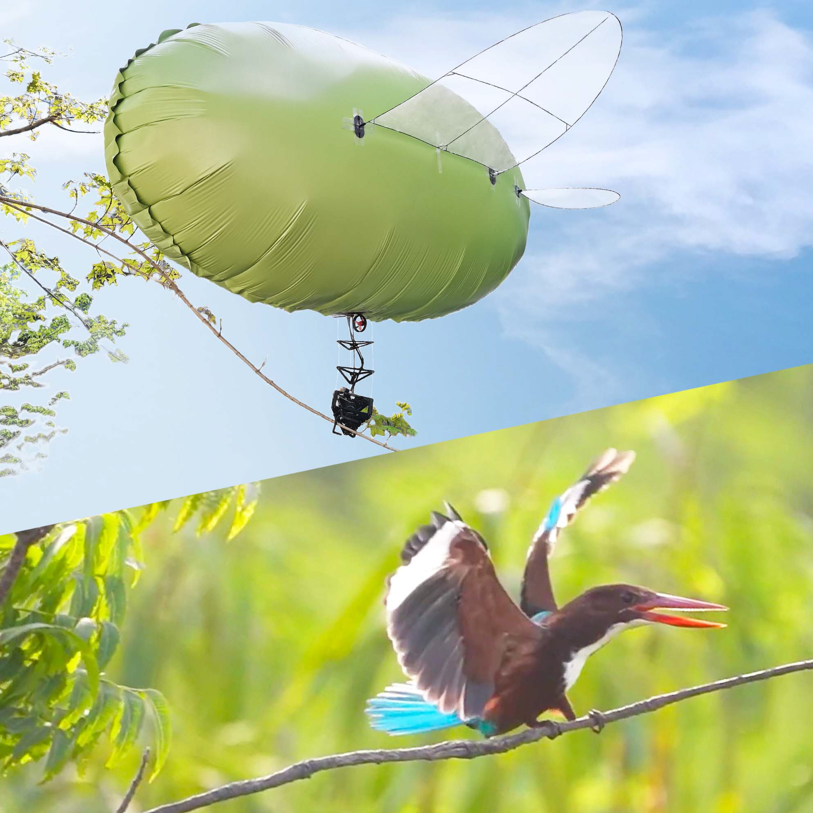

I am Hao Cheng (程淏). 
Currently, I working toward the Ph.D. degree in Mechanics at Peking University, China, under the supervision of [Prof. Feitian Zhang](http://www2.coe.pku.edu.cn/faculty/zhangfeitian/). 
My research interests include light-than-air (LTA) aerial robots, continuum robots, and bioinspired robotics. 

**Email**: [h-cheng@stu.pku.com](mailto:h-cheng@stu.pku.com)

---

# Education

&emsp;**College of Engineering, Peking University** &emsp; _09/2021 - present_  
&emsp;*Beijing, China*  
&emsp;Ph.D. candidate in Mechanics

&emsp;**Department of Automation, Tsinghua University** &emsp; _09/2018 - 08/2021_  
&emsp;*Beijing/Shenzhen, China*  
&emsp;M.S. in Control Engineering 

&emsp;**New Energy School, North China Electric Power University** &emsp; _08/2013 - 06/2017_  
&emsp;*Beijing, China*  
&emsp;B.E. in Wind Power (**Outstanding Graduate at Beijing**)

&emsp;**Wrocław University of Science and Technology** &emsp; _02/2017 - 06/2017_  
&emsp;*Wrocław,  Poland*  
&emsp;Visiting Student

---

# Research Experience

&emsp;**College of Engineering, Peking University** &emsp; _09/2021 - present_  
&emsp;*Beijing, China*  
&emsp;**Advisor**: <a href="http://www2.coe.pku.edu.cn/faculty/zhangfeitian/" style="color: inherit; text-decoration: none;">Prof. Feitian Zhang</a>  
&emsp;**Topic**: Lighter-than-air aerial robots 

&emsp;**Shenzhen International Graduate School, Tsinghua University** &emsp; _09/2018 - 08/2021_  
&emsp;*Shenzhen, China*  
&emsp;**Advisor**: <a href="https://www.sigs.tsinghua.edu.cn/lhd_en/list.htm" style="color: inherit; text-decoration: none;">Prof. Houde Liu</a>, <a href="https://www.sigs.tsinghua.edu.cn/wxq_en/main.htm" style="color: inherit; text-decoration: none;">Prof. Xueqian Wang</a>  
&emsp;**Topic**: Perception and Control for Continuum Robots and Soft Robots 

---

# Publications

**Preprint Papers**

  
  

    
<strong>Hao Cheng</strong>, Feitian Zhang

    
RGBlimp-Q: Robotic Gliding Blimp With Moving Mass Control Based on a Bird-Inspired Continuum Arm

    
Preprint, 2024

    

      [<a href="https://rgblimp.github.io/" style="text-decoration: underline;">Project Page</a>]  
      [<a href="https://youtu.be/yA_nncO6qE4" style="text-decoration: underline;">Video</a>]  
      [<a href="https://arxiv.org/pdf/2406.10810" style="text-decoration: underline;">arXiv</a>]
      

  

  
  

    
Yongjian Zhu, <strong>Hao Cheng</strong>, Feitian Zhang

    
Data-Driven Dynamics Modeling of Miniature Robotic Blimps Using Neural ODEs With Parameter Auto-Tuning

    
Preprint, 2024 (Accepted in <strong>IEEE Robotics and Automation Letters</strong>)

    

      [<a href="https://arxiv.org/pdf/2404.18580" style="text-decoration: underline;">arXiv</a>]
      

  

**Journal Papers**

  
  

    
<strong>Hao Cheng</strong>, Zeyu Sha, Yongjian Zhu, Feitian Zhang

    
RGBlimp: Robotic Gliding Blimp - Design, Modeling, Development, and Aerodynamics Analysis

    
IEEE Robotics and Automation Letters (<strong>RA-L</strong>), 2023 (Oral Presentation in IEEE <strong>IROS</strong> 2024)

    

      [<a href="https://ieeexplore.ieee.org/document/10258385" style="text-decoration: underline;">Paper</a>]  
      [<a href="https://youtu.be/AkYN0jurYxI" style="text-decoration: underline;">Video</a>]  
      [<a href="https://arxiv.org/pdf/2306.04079" style="text-decoration: underline;">arXiv</a>]
      

  

**Conference Papers**

  
  

    
<strong>Hao Cheng</strong>, Hejie Xu, Hongji Shang, Xueqian Wang, Houde Liu, Bin Liang

    
Orientation to Pose: Continuum Robots Shape Reconstruction Based on the Multi-Attitude Solving Approach

    
IEEE International Conference on Robotics and Automation (<strong>ICRA</strong>), 2022 (Oral Presentation)

    

      [<a href="https://ieeexplore.ieee.org/document/9812289" style="text-decoration: underline;">Paper</a>]  
      [<a href="https://youtu.be/tm9aPsXuPTo" style="text-decoration: underline;">Video</a>]  
      [<a href="https://arxiv.org/pdf/2103.05150" style="text-decoration: underline;">arXiv</a>]
      

  

  
  

    
<strong>Hao Cheng</strong>, Houde Liu, Xueqian Wang, Bin Liang

    
Configuration Estimation of Continuum Robots Using Piecewise Constant Curvature Generalized Epi-Polar Constraint Model

    
IEEE 17th International Conference on Automation Science and Engineering (CASE), 2021

    

      [<a href="https://ieeexplore.ieee.org/document/9551587" style="text-decoration: underline;">Paper</a>] 
      

  

  
  

    
<strong>Hao Cheng</strong>, Houde Liu, Xueqian Wang, Bin Liang

    
Approximate Piecewise Constant Curvature Equivalent Model and Their Application to Continuum Robot Configuration Estimation

    
IEEE International Conference on Systems, Man, and Cybernetics (SMC), 2020

    

      [<a href="https://ieeexplore.ieee.org/document/9283135" style="text-decoration: underline;">Paper</a>]  
      [<a href="https://arxiv.org/pdf/2009.06801" style="text-decoration: underline;">arXiv</a>]
      

  

**Patents**

1. H. Liu, **H. Cheng**, X. Wang, B. Lan, and B. Liang, Continuum Robot Shape Sensing Method Based on the Multi-attitude Solving Approach (一种基于多姿态解算的连续型机器人形状感知方法), Chinese Patent CN113211440B, 2020. [[Google Patents](https://patents.google.com/patent/CN113211440B/en)]
2. B. Liang，H. Liu, **H. Cheng**, X. Wang, and B. Lan, Kinematic Equivalence Method of Continuum Robot and Its Application (一种连续型机器人运动学等效方法及应用), Chinese Patent CN111695213B, 2020. [[Google Patents](https://patents.google.com/patent/CN111695213B/en)]

---

# Awards & Honors

-  Peking University Outstanding Research Award (北京大学科研优秀奖) &emsp; _2022_
-  Tsinghua Comprehensive Excellence Scholarship (清华大学综合优秀奖学金) &emsp; _2020_
-  **Outstanding Graduate at Beijing** (北京市优秀毕业生) &emsp; _2017_
-  **China National Scholarship** (国家奖学金) &emsp; _2015_
-  China National Encouragement Scholarship (国家励志奖学金) &emsp; _2014/2016_
-  NCEPU First-class Honour Scholarship (华北电力大学一等奖学金) &emsp; _2014/2015/2016_

---

# Competitions

- 2nd Place in ZC-Cup frontier Technology Challenge（Team Work, In charge of autonomous navigation part） &emsp; _2020_
- 1nd Place in Capital Mechanical Innovation Design Competition（Team Leader, Designed an Express Packaging Robot） &emsp; _2016_
- 1nd Place in China Siemens-Cup Intelligent Manufacturing Challenge  &emsp; _2016_
- Champion in Robots Competition of Universities at Beijing (Team Leader, Robots Battle)  &emsp; _2015_
- 2nd Place in Beijing Engineering Ability Competition（Team Leader, Designed a Bluetooth Explosive Disposal Robot） &emsp; _2015_
- 2nd Place in China LQ-Cup C/C++ Programming Competition（Individual Events） &emsp; _2015_

---

# Academic Service

- Reviewer for IEEE ICRA, IROS, CDC, ACC, AIM