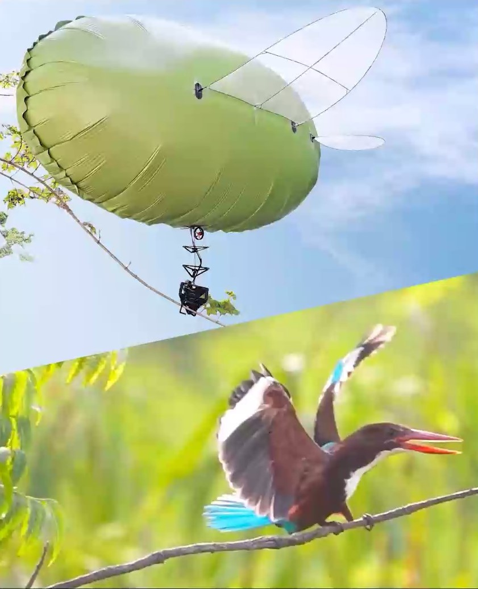
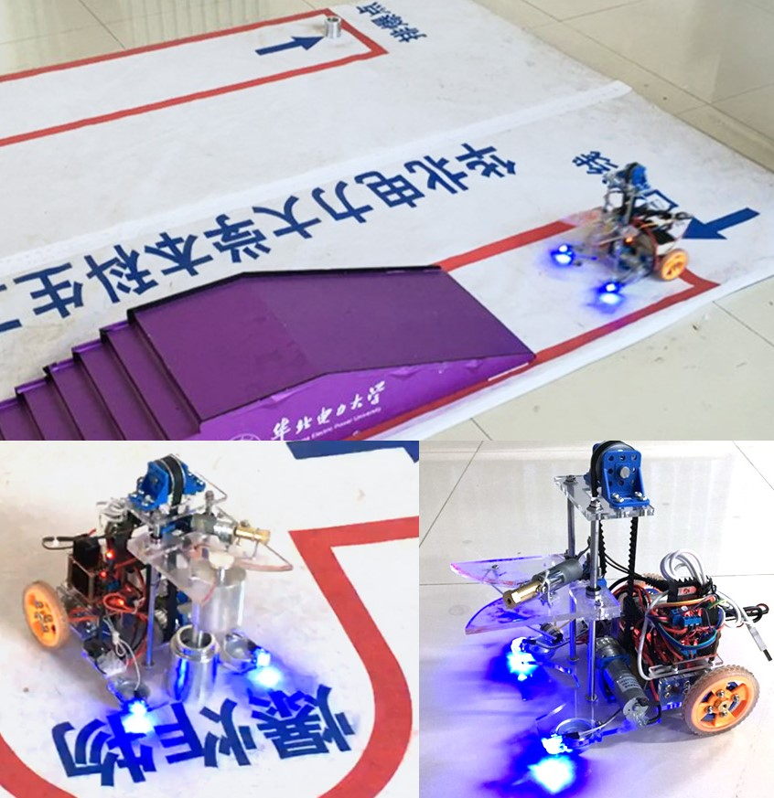



---

# Research Projects

<h2> RGBlimp-Q: Robotic Gliding Blimp With Moving Mass Control Based on a Bird-Inspired Continuum Arm </h2>

  
  

  
<strong>Description</strong>:
    Robotic blimps, as lighter-than-air aerial systems, offer prolonged duration and enhanced safety in human-robot interactions due to their buoyant lift. However, robust flight against environmental airflow disturbances remains a significant challenge, limiting the broader application of these robots.
  

  

    Drawing inspiration from the flight mechanics of birds and their ability to perch against natural wind, this project introduces RGBlimp-Q, a robotic gliding blimp equipped with a birdinspired continuum arm. This arm allows for flexible attitude adjustments through moving mass control to enhance disturbance resilience, while also enabling object capture by using claws to counteract environmental disturbances, similar to a bird. This project presents the design, modeling, and prototyping of RGBlimp-Q, thus extending the advantages of robotic blimps to more complex environments. To the best of the authors’ knowledge, this is the first interdisciplinary design integrating continuum mechanisms onto robotic blimps. Experimental results from both indoor and outdoor settings validate the improved flight robustness against environmental disturbances offered by this novel design. 
  

  [<a href="https://rgblimp.github.io/" style="text-decoration: underline;">Project Page</a>] [<a href="https://github.com/RGBlimp/RGBlimp-Q" style="text-decoration: underline;">Hardware & Code</a>] 

---

# Competition Projects

<h2 id="bcar"> Bluetooth Cargo Robot </h2>

  
  

  
<strong>Description</strong>:
    This project, originated from <i>the 2015 Beijing Engineering Ability Competition</i>, entailed the development of a Bluetooth cargo robot operated via a smartphone. The robot incorporates a differential drive mechanism facilitating flexibility. The robot is equipped with automatic control for lid opening, object retrieval, and cargo transportation, ensuring the secure conveyance of 100g loads to designated locations. The project involves mechanical design, electronic control, and system integration. 
  

  
<strong>Outcome</strong>:
    2nd Place in Beijing Engineering Ability Competition, 2015（Team Leader）
  

