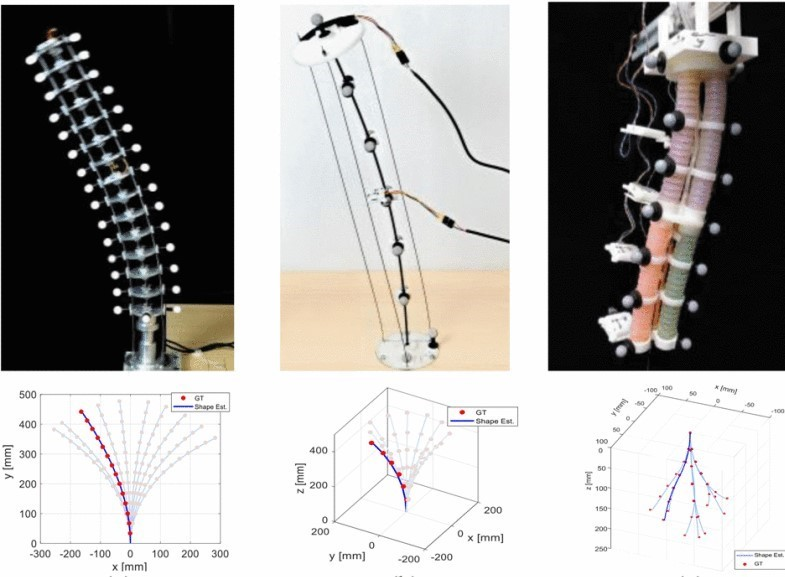



<h1> Research Projects </h1>

<h2> RGBlimp-Q: Robotic Gliding Blimp With Moving Mass Control Based on a Bird-Inspired Continuum Arm </h2>

  
  

  
<strong>Description</strong>:
    Robotic blimps, as lighter-than-air aerial systems, offer prolonged duration and enhanced safety in human-robot interactions due to their buoyant lift. However, robust flight against environmental airflow disturbances remains a significant challenge, limiting the broader application of these robots.
  

  

    Drawing inspiration from the flight mechanics of birds and their ability to perch against natural wind, this project introduces RGBlimp-Q, a robotic gliding blimp equipped with a birdinspired continuum arm. This arm allows for flexible attitude adjustments through moving mass control to enhance disturbance resilience, while also enabling object capture by using claws to counteract environmental disturbances, similar to a bird. This project presents the design, modeling, and prototyping of RGBlimp-Q, thus extending the advantages of robotic blimps to more complex environments. To the best of the authors’ knowledge, this is the first interdisciplinary design integrating continuum mechanisms onto robotic blimps. Experimental results from both indoor and outdoor settings validate the improved flight robustness against environmental disturbances offered by this novel design. 
  

  [<a href="https://rgblimp.github.io/" style="text-decoration: underline;">Project Page</a>] [<a href="https://github.com/RGBlimp/RGBlimp-Q" style="text-decoration: underline;">Hardware & Code</a>] 

<h2 id="rgblimp"> RGBlimp: Robotic Gliding Blimp -- Design, Modeling, Development, and Aerodynamics Analysis </h2>

  
  

  
<strong>Description</strong>:
    A robotic blimp, as one type of lighterthan-air aerial vehicle, has attracted increasing attention in the science and engineering field for its long flight duration and safe aerial locomotion. While a variety of robotic blimps have been developed over the past decade, most of them utilize the buoyant lift and neglect the aerodynamic lift in their design, thus leading to a mediocre aerodynamic performance, particularly in terms of aerodynamic efficiency and aerodynamic stability.
  

  

    This project proposes a new design of robotic blimp that combines desirable features of both a robotic blimp and a fixed-wing glider, named the <i>Robotic Gliding Blimp</i>, or <i>RGBlimp</i>. This robot, equipped with an envelope filled with helium and a pair of wings, uses an internal moving mass and a pair of propellers for its locomotion control. This project presents the design, dynamic modeling, prototyping, and system identification of the RGBlimp.  Experimental results are presented to validate the design and the dynamic model of the RGBlimp. Analysis of the RGBlimp aerodynamics is conducted which confirms the performance improvement of the proposed RGBlimp in aerodynamic efficiency and flight stability. 
  

  [<a href="https://ieeexplore.ieee.org/document/10258385" style="text-decoration: underline;">Paper</a>]  
  [<a href="https://youtu.be/AkYN0jurYxI" style="text-decoration: underline;">Video</a>]  
  [<a href="https://arxiv.org/pdf/2306.04079" style="text-decoration: underline;">arXiv</a>]

<h2> Previous Attempts in Robotic Blimp Design </h2>

  

  
<strong>Description</strong>:
    This section showcases our early robotic blimp designs and prototypes. Although some were phased out due to flaws, they provided valuable insights for subsequent developments. 
  

<h2 id="continuum"> Continuum Robots Shape Reconstruction Based on the Multi-Attitude Solving Approach </h2>

  
  

  
<strong>Description</strong>:
    Continuum robots are typically slender and flexible with infinite freedoms in theory, which poses a challenge for their control and application. The shape reconstruction of continuum robots is vital to realize closed-loop control. This project proposes a novel general real-time shape reconstruction framework of continuum robots based on the piecewise polynomial curvature (PPC) kinematics model. We illustrate the coupling between orientation and position at any given location of the continuum robots. Further, the coupling relation could be bridged by the PPC kinematics. Therefore, we propose to estimate the shape through multi-attitude solving, using the off-the-shelf orientation sensors, e.g., IMUs, mounted on certain locations. The approach gives a valuable framework to real-time shape reconstruction of continuum robots, which is general, accurate and convenient. The accuracy of our approach is verified in the experiments of distinct physical prototypes. 
  

  [<a href="https://ieeexplore.ieee.org/document/9812289" style="text-decoration: underline;">Paper</a>]  
  [<a href="https://youtu.be/tm9aPsXuPTo" style="text-decoration: underline;">Video</a>]  
  [<a href="https://arxiv.org/pdf/2103.05150" style="text-decoration: underline;">arXiv</a>]

<h1> Competition Projects </h1>

<h2 id="maze"> Maze Challenge in ZC-Cup Frontier Technology Challenge </h2>

  
  

  
<strong>Description</strong>:
    <i>The 2020 ZC-Cup frontier Technology Challenge</i> centers on the theme of "Post-disaster Area Detection and Disposal," featuring 13 competition tasks. These tasks include traversing complex terrain, clearing obstacles, opening doors, ascending and descending stairs, autonomous navigation in unknown areas (maze challenge), handling fire emergencies in smoke-filled environments, and rescuing lives. Robots competed in a 4000-square-meter final arena simulating a post-disaster environment. In our team collaboration, I primarily contributed to the maze challenge, achieving autonomous navigation using LiDAR sensing and the RRT algorithm. 
  

  
<strong>Outcome</strong>:
    2nd Place in ZC-Cup frontier Technology Challenge, 2020 (Team Work, Contributions to the autonomous navigation of a maze challenge)
  

<h2 id="battle"> Robots Combat </h2>

  

  
<strong>Description</strong>:
     <i>The Robot Combat Competition</i> is a defensive and offensive contest between robots of red and blue teams. Each team's robots must navigate obstacles, engage opponents, and attack the opponent's life tower. The team with the highest score wins. The 12m x 12m arena has bases at opposite corners and obstacles like broken bridges and turntables. We designed four different wheeled robots, including one remotely operated through visual teleoperation. We emerged as champion after intense competition. 
  

  
<strong>Outcome</strong>:
    <strong>Champion</strong> in Robots Competition of Universities at Beijing, 2015 (Team Leader, Robots Battle)
  

<h2 id="bcar"> Bluetooth Cargo Robot </h2>

  
  

  
<strong>Description</strong>:
    This project, originated from <i>the 2015 Beijing Engineering Ability Competition</i>, entailed the development of a Bluetooth cargo robot operated via a smartphone. The robot incorporates a differential drive mechanism facilitating flexibility. The robot is equipped with automatic control for lid opening, object retrieval, and cargo transportation, ensuring the secure conveyance of 100g loads to designated locations. The project involves mechanical design, electronic control, and system integration. 
  

  
<strong>Outcome</strong>:
    2nd Place in Beijing Engineering Ability Competition, 2015（Team Leader）
  

